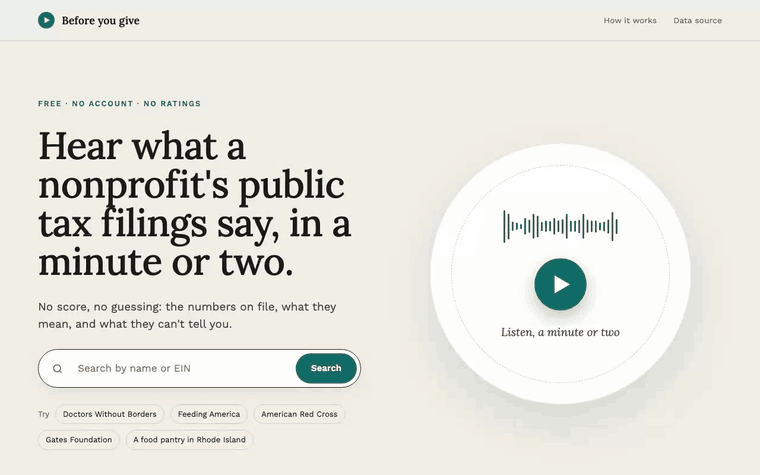
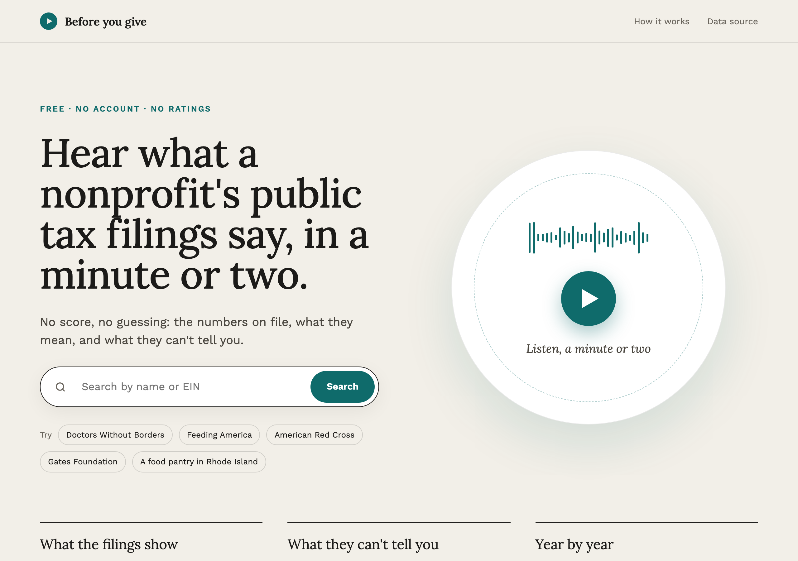
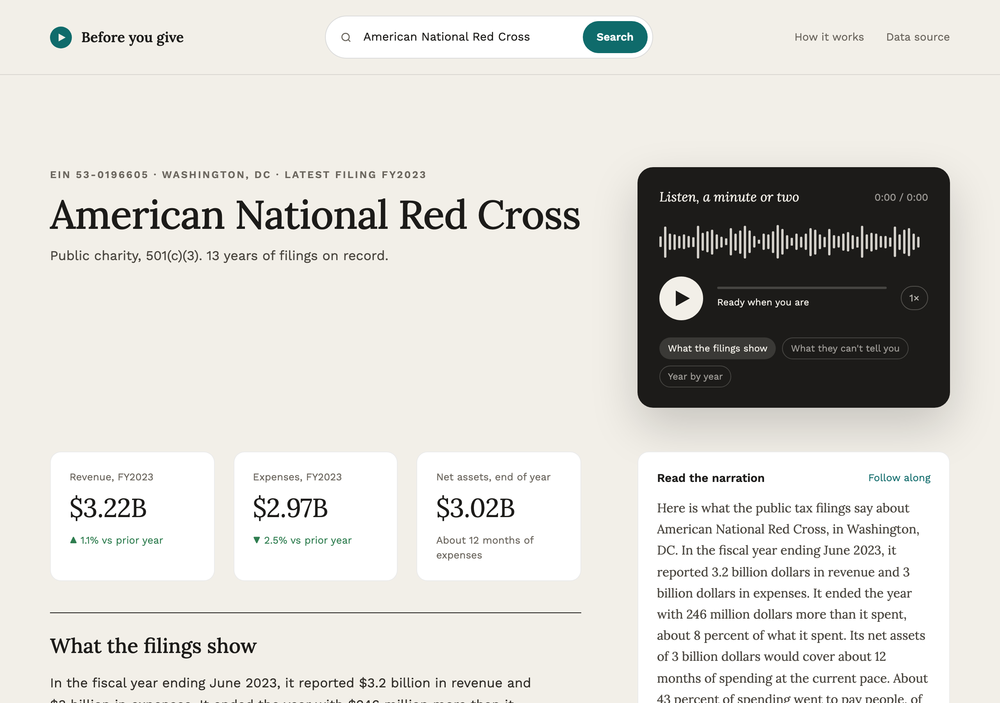
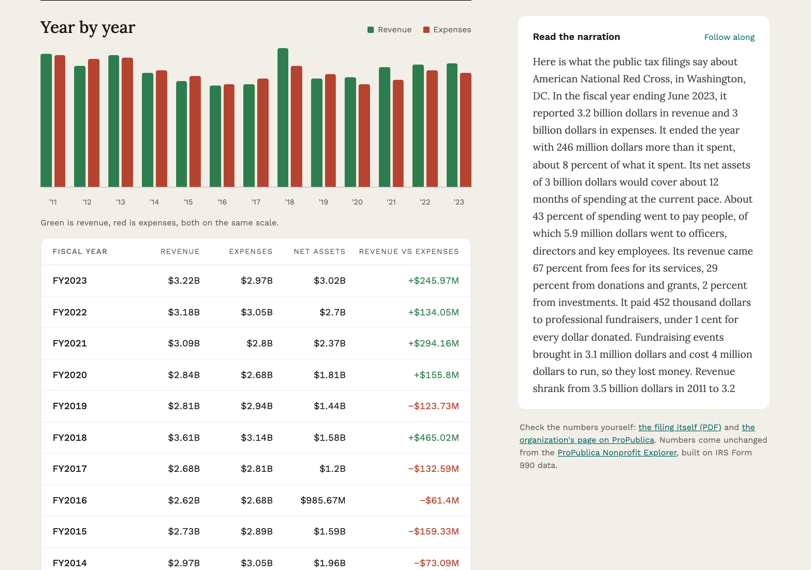
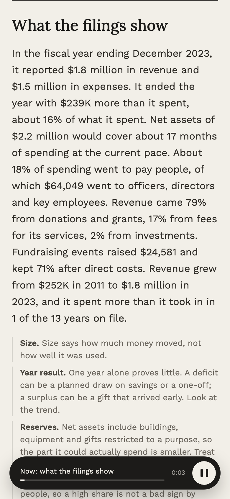

# before-you-give

[](https://github.com/vinimabreu/before-you-give/actions/workflows/ci.yml)


Type the name of a US nonprofit and hear, in a minute or two, what its public tax filings say: how much money moved, whether it spent more than it took in, how many months of reserves it holds, where the money comes from, and how that has moved over a decade. Then, in the same breath, what those filings cannot tell you.

No score. No ranking. No language model writing the numbers.

**Live:** https://before-you-give.vercel.app



A real session on the live site: search, pick the organization, listen, follow the narration, scroll to the chart. The same clip as an MP4: [assets/demo.mp4](assets/demo.mp4).

## Screens

| Landing | Reading |
|---|---|
|  |  |

| Year by year | Phone |
|---|---|
|  |  |

## Why there is no score

Every charity rating site ends in a number, and the number has to weigh things the filing does not measure. A Form 990 records what an organization took in and what it spent. It does not record whether the work was any good, whether the reserves are restricted to a purpose, or what happened after the fiscal year closed. A score built on it is a guess dressed as a figure, and a donor who trusts the figure is trusting the guess.

So the unit here is not a score. It is a `Fact`: a value, a plain sentence saying what it means, and a `limit` saying what it does not mean. The limit is a required field. `reading.py` cannot produce a fact without one.

```
Reserves                   about 12 months
    Net assets of $3 billion would cover about 12 months of spending at the current pace.
    limit: Net assets include buildings, equipment and gifts restricted to a purpose,
           so the part it could actually spend is smaller. Treat this as an upper bound.
```

The same discipline applies to what is missing. The program / administration / fundraising split is on the filing but not in the data feed, so the page says so instead of pretending. An organization with no numbers on file is told that small organizations file a postcard and churches do not file at all, because absence of data is not a warning sign and a page that implied otherwise would be lying by layout.

## Where the numbers come from

Every figure is read unchanged from the [ProPublica Nonprofit Explorer](https://projects.propublica.org/nonprofits/) API, which republishes IRS Form 990 extract data. The page links the filing PDF and the organization's ProPublica page so anyone can check. Per ProPublica's [data terms](https://projects.propublica.org/datastore/terms/), this project cites them, charges nobody, and does not republish the dataset; it keeps a short-lived cache so the API is not hit twice for the same organization. The six recorded responses under `tests/fixtures/` exist only to pin the tests, and they are ProPublica's.

## The voice

The narration is assembled by templates in `narration.py` from the facts above, so the spoken text cannot drift from the data. It is then rendered with [ElevenLabs](https://elevenlabs.io) text to speech, with two rules written before the first paid call:

- **Cache by text.** The same organization never costs twice; the mp3 is stored by the hash of the script.
- **A hard cap.** `BYG_TTS_MAX_CALLS` and `BYG_TTS_MAX_CHARS` are checked before every request. Past either ceiling the server answers 429 and keeps serving what is already cached. A per-address limiter (6 new narrations an hour) sits in front of that.

Without `ELEVENLABS_API_KEY` the app runs text-only and says so on the page. Nothing else changes.

Why a voice at all: a filing is a wall of numbers, and the people this is for are not the people who read walls of numbers. Spoken, with the money in words instead of signs, it is something you can take in on the way to deciding.

## Run it

```bash
git clone https://github.com/vinimabreu/before-you-give
cd before-you-give
python -m venv .venv && source .venv/bin/activate
pip install -e ".[dev]"
pytest                                   # 82 tests, offline, no key

python -m examples.offline_demo          # five saved filings, no network
python -m before_you_give "east bay food pantry" --state RI
python -m before_you_give --ein 53-0196605

uvicorn before_you_give.app:app          # http://127.0.0.1:8000
```

Environment:

| Variable | Default | Meaning |
|---|---|---|
| `ELEVENLABS_API_KEY` | unset | enables the voice |
| `BYG_VOICE_ID` | a premade ElevenLabs voice | any voice id from your account |
| `BYG_TTS_MODEL` | `eleven_turbo_v2_5` | model id |
| `BYG_TTS_MAX_CALLS` | `200` | narrations this process may buy |
| `BYG_TTS_MAX_CHARS` | `200000` | characters this process may buy |
| `BLOB_READ_WRITE_TOKEN` | unset | store narrations in Vercel Blob instead of on disk (serverless); the call ceiling then counts narrations stored |
| `BYG_TRUST_PROXY` | unset | `1` behind nginx or Vercel, so the per-address limiter sees the real address |

## Layout

```
src/before_you_give/
  propublica.py   client, disk cache, typed Filing / Organization
  reading.py      facts with limits; the arithmetic, all of it
  format.py       one rendering for the eye, one for the voice
  narration.py    the deterministic script
  speech.py       ElevenLabs with cache and cap; disk store or Vercel Blob
app.py            the same app as a Vercel function (zero-config FastAPI)
  app.py          FastAPI: /, /api/search, /api/org/{ein}, /api/org/{ein}/audio.mp3
  web/index.html  the page, no build step
tests/fixtures/   real API responses: two 990s, a 990-EZ, a 990-PF, an org with no filings
```

The fetchers are injected callables, so the whole suite runs offline. `tests/test_reading.py` pins the arithmetic against the American Red Cross filing for fiscal 2023, field by field.

## What it is not

It is not advice. It does not know your cause, and it does not know whether an organization is effective. It knows what a filing says, and it tells you where the filing stops.

## License

MIT. Data: ProPublica Nonprofit Explorer, IRS Form 990.
